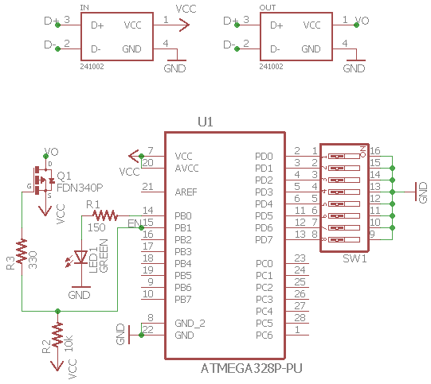

# USB Power Cycler
A design using an ATMega328P-PU microcontroller to delay the voltage rail pass-through.

## Purpose
The reason behind the design was to delay the start up of a USB car handsfree receiver that would stop functioning due to power being cycling to the device when switching from the ACC to ON ignition states.

## Design Information
The choice of the microcontroller may seem a bit overkill however due to it's popularity and the fact that the Arduino Uno boards use the exact same MCU I chose it to allow a smooth transition between my Arduino prototype over to an independant MCU using the internal 8MHz clock. Depending on how you source your ATMega328P-PU it may come preloaded with a bootloader designed for a 16MHz external crystal such as in the Arduino Uno or it may come with no bootloader burned at all. Either way you will need to use a different bootloader with the approparite fuses enabled to use the internal clock. More information can be found [here](https://www.arduino.cc/en/Tutorial/ArduinoToBreadboard). An 8-bit DIP switch is used to control the delay time. Values from 0 to 255 seconds are possible with the 8-bits and must be used in binary form. The firmware loaded on the MCU is relatively straight forward and an Arduino sketch is also available. The FDN340P is logic level p-channel MOSFET is being used as a high side switch for the 5V rail.

## Schematic View

## Board View

